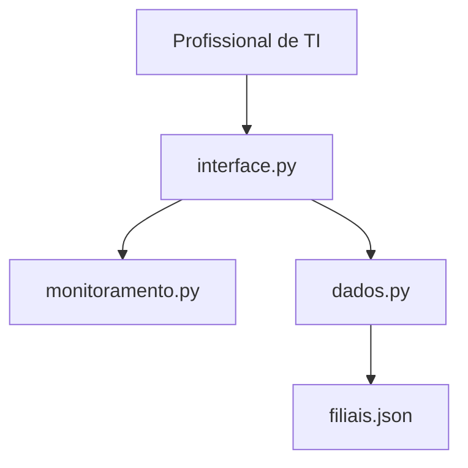

# Arquitetura do Sistema

## 1. Objetivo

A arquitetura do Monitor de Conexão Local foi planejada para manter o código simples, organizado e fácil de evoluir.

O projeto separa a interface, a verificação de ping e a persistência dos dados em arquivos com responsabilidades específicas.

## 2. Estrutura planejada

```text
MonitorPing/
├── main.py
├── interface.py
├── monitoramento.py
├── dados.py
├── filiais.json
├── filiais.exemplo.json
├── .gitignore
├── README.md
└── docs/
```

A estrutura acima representa o planejamento do projeto. O arquivo `main.py` ainda não foi implementado. Atualmente, o programa é iniciado diretamente por `interface.py`, utilizando o comando `python interface.py`.

O arquivo `filiais.json` é local e permanece ignorado pelo Git.

## 3. Responsabilidades dos arquivos

| Arquivo | Responsabilidade |
|---|---|
| `main.py` | Previsto para centralizar a inicialização do programa; ainda não implementado. |
| `interface.py` | Criar a interface em Tkinter, receber as ações de cadastro, edição e exclusão, coordenar o monitoramento e apresentar os resultados. |
| `monitoramento.py` | Executar a verificação de ping de um endereço IP e retornar o resultado à interface. |
| `dados.py` | Carregar, salvar, adicionar, editar e excluir filiais no arquivo JSON local. |
| `filiais.json` | Armazenar o nome e o IP do roteador de cada filial apenas na máquina local, sem envio ao GitHub. |
| `filiais.exemplo.json` | Apresentar um exemplo público do modelo de dados com endereços fictícios. |

## 4. Relação entre os componentes



O diagrama representa a implementação atual. A interface utiliza `dados.py` para consultar e modificar os cadastros e `monitoramento.py` para verificar os endereços IP. O arquivo `main.py` não participa desse fluxo enquanto não estiver implementado.

## 5. Decisão de arquitetura

A primeira versão utiliza uma aplicação desktop local em Python, com interface em Tkinter e persistência em JSON, sem banco de dados.

As verificações de ping são executadas em uma thread separada para não bloquear a interface. Ao concluir a rodada, o resultado é encaminhado à janela por `janela.after()`, que agenda a atualização da tabela e do horário exibido.

O monitoramento automático tenta iniciar uma rodada a cada 10 segundos. A variável `monitoramento_em_andamento` impede que a atualização manual ou automática inicie outra rodada enquanto a anterior estiver em execução.

Os roteadores são verificados sequencialmente. Portanto, uma rodada pode durar mais de 10 segundos quando houver muitos endereços sem resposta. O intervalo de agendamento não garante que todos os resultados sejam renovados nesse prazo.

O caminho de `filiais.json` é definido a partir da localização de `dados.py`, mantendo os dados na pasta do projeto independentemente do diretório usado para iniciar o programa.

Essa organização permite evoluir o projeto gradualmente, mantendo separadas as responsabilidades de apresentação, monitoramento e persistência.

## 6. Modelo de dados

Cada filial é registrada com seu nome e o endereço IP de um único roteador.

```json
[
  {
    "nome": "Filial Exemplo",
    "ip": "192.0.2.10"
  }
]
```

O campo `nome` identifica a filial. O campo `ip` informa o endereço utilizado na verificação de ping do roteador.

Os nomes das filiais não podem se repetir, sem diferenciar letras maiúsculas e minúsculas. Quando não existem cadastros, o arquivo contém uma lista vazia (`[]`).

O status de conectividade e o horário da última atualização não são gravados no JSON. Eles são calculados durante a execução e apresentados na interface.

O status representa a resposta ao ping do roteador, não uma confirmação do funcionamento da internet ou de todos os serviços da filial.

O arquivo `filiais.json` contém os dados reais apenas na máquina local e permanece ignorado pelo Git. O arquivo `filiais.exemplo.json` deve acompanhar esse modelo, utilizando somente dados fictícios.