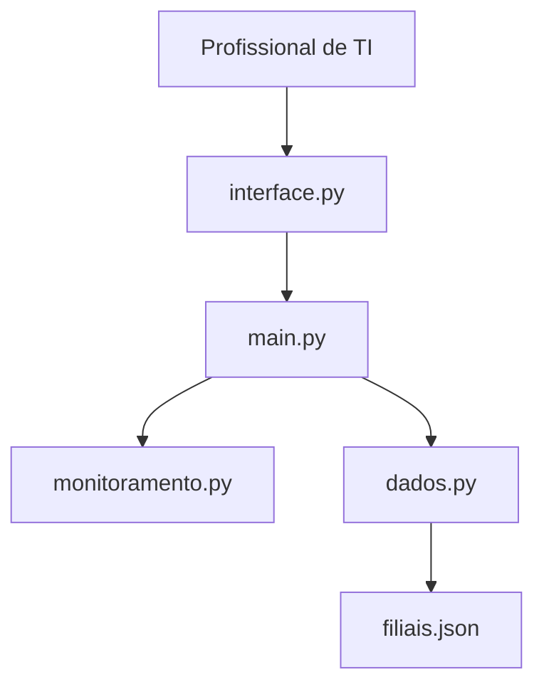

# Arquitetura do Sistema

## 1. Objetivo

A arquitetura do Monitor de Conexão Local foi planejada para manter o código simples, organizado e fácil de evoluir.

Cada arquivo terá uma responsabilidade específica, evitando concentrar toda a lógica em um único arquivo.

## 2. Estrutura planejada

```text
MonitorPing/
├── main.py
├── interface.py
├── monitoramento.py
├── dados.py
├── filiais.json
├── filiais.exemplo.json
├── .gitignore
├── README.md
└── docs/
```

## 3. Responsabilidades dos arquivos

| Arquivo | Responsabilidade |
|---|---|
| `main.py` | Iniciar o programa e organizar a execução principal. |
| `interface.py` | Criar a interface gráfica usando Tkinter. |
| `monitoramento.py` | Realizar o ping dos endereços IP e retornar o status de conectividade. |
| `dados.py` | Ler e salvar as filiais cadastradas no arquivo JSON. |
| `filiais.json` | Armazenar localmente os dados reais das filiais. Esse arquivo não será enviado ao GitHub. |
| `filiais.exemplo.json` | Apresentar um exemplo de estrutura de dados sem utilizar IPs reais. |

## 4. Relação entre os componentes



## 5. Decisão de arquitetura

A estrutura foi mantida pequena porque a primeira versão será uma aplicação local em Python.

Caso o projeto cresça no futuro, será possível adicionar novos arquivos e funcionalidades sem precisar reescrever toda a aplicação.