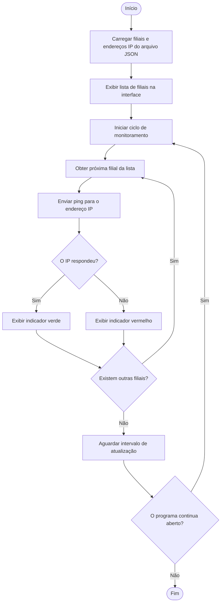

# Diagrama de Atividades — Monitoramento de Conectividade

## Objetivo

Este diagrama representa o fluxo automático de monitoramento dos endereços IP cadastrados no sistema.

## Interpretação

Ao iniciar, o sistema carrega as filiais cadastradas no arquivo JSON e exibe a lista na interface.

Em seguida, realiza um ping para cada endereço IP. Caso o endereço responda, o sistema exibe o indicador verde. Caso não responda, exibe o indicador vermelho.

Após verificar todas as filiais, o sistema aguarda o intervalo definido e reinicia o monitoramento enquanto o programa estiver aberto.
