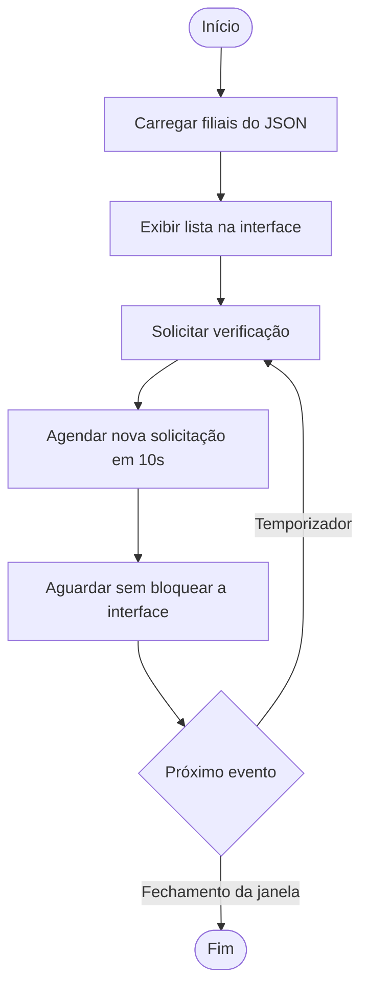
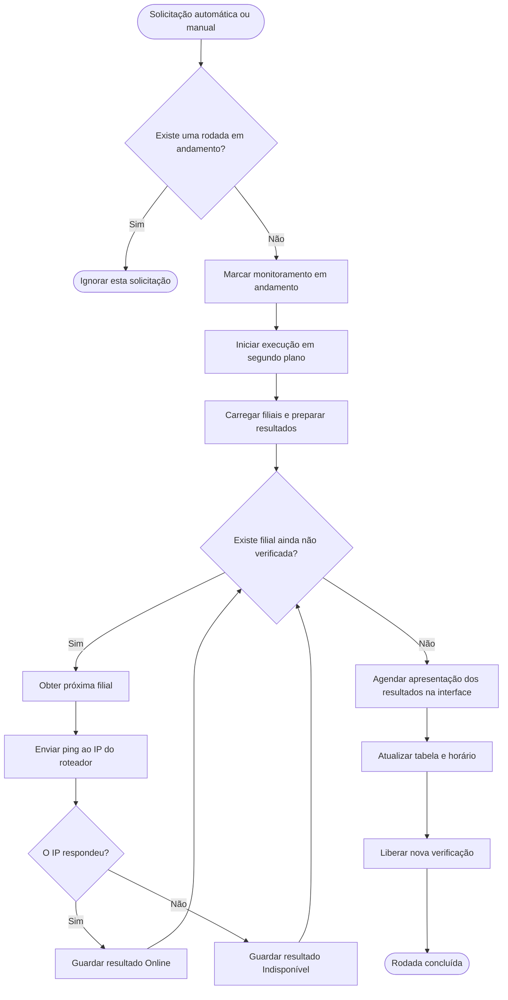

# Diagrama de Atividades — Monitoramento de Conectividade

## Objetivo

Este documento representa o agendamento automático e a execução das verificações de ping dos roteadores cadastrados.

### Agendamento automático

### Execução de uma verificação

## Interpretação

Ao abrir o programa, o sistema carrega os cadastros, exibe a lista e solicita a primeira verificação. As solicitações automáticas seguintes são agendadas a cada 10 segundos enquanto a janela estiver aberta.

Cada solicitação verifica se já existe uma rodada em andamento. Se existir, a solicitação é ignorada. Caso contrário, o sistema inicia uma thread para executar os pings sem bloquear a interface.

Os roteadores são verificados um por vez. Os resultados são guardados durante a rodada e apresentados juntos ao final, com indicador verde para Online e vermelho para Indisponível.

Ao concluir a rodada, o sistema atualiza também o horário exibido e libera o início de outra verificação. Se não houver filiais cadastradas, a rodada termina sem executar pings, atualizando a tabela vazia e o horário.

O botão de atualização manual utiliza a mesma proteção contra rodadas simultâneas, mas não cria outro agendamento automático.

O intervalo de 10 segundos representa o agendamento das solicitações. Uma rodada pode durar mais que esse intervalo; nesse caso, as solicitações recebidas enquanto ela estiver em andamento são ignoradas.

Os diagramas representam o fluxo normal da implementação. O tratamento de falhas durante a verificação e o fechamento da janela com uma rodada em andamento ainda precisam de validação específica.