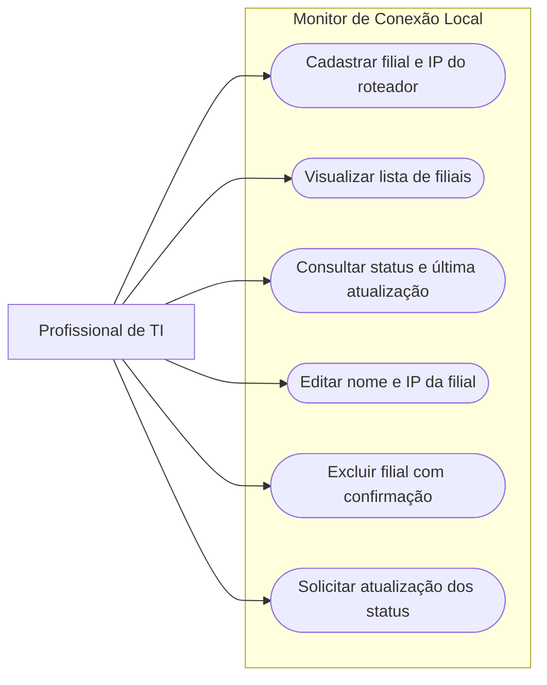

# Diagrama de Caso de Uso

## Objetivo

## Interpretação

O profissional de TI é o usuário do sistema.

Ele pode cadastrar uma filial com o endereço IP de um único roteador, editar seu nome e IP e excluir um cadastro após confirmar a operação.

A interface permite visualizar as filiais cadastradas, consultar o resultado da última verificação de ping de cada roteador e acompanhar o horário da última atualização concluída.

O usuário também pode solicitar uma atualização manual dos status. O monitoramento automático ocorre enquanto o programa está aberto, sem exigir cliques a cada rodada.

O diagrama utiliza um fluxograma Mermaid para representar as interações de forma simplificada; não corresponde à notação completa de um diagrama UML de casos de uso.