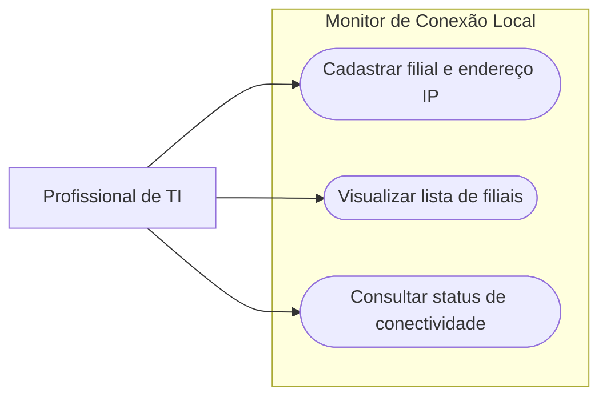

# Diagrama de Caso de Uso

## Objetivo

Este diagrama representa as principais interações entre o profissional de TI e o sistema Monitor de Conexão Local.

## Interpretação

O profissional de TI é o usuário do sistema.

Ele poderá cadastrar filiais e seus respectivos endereços IP, visualizar a lista de filiais cadastradas e consultar o status de conectividade de cada uma delas.